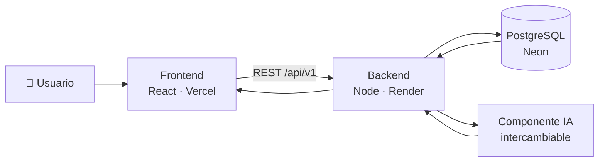
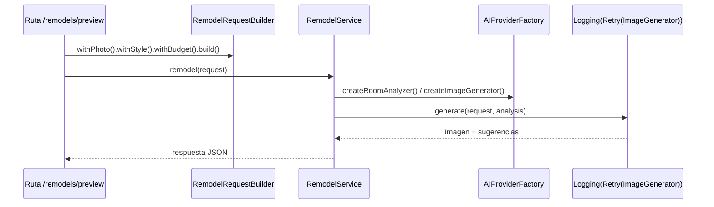
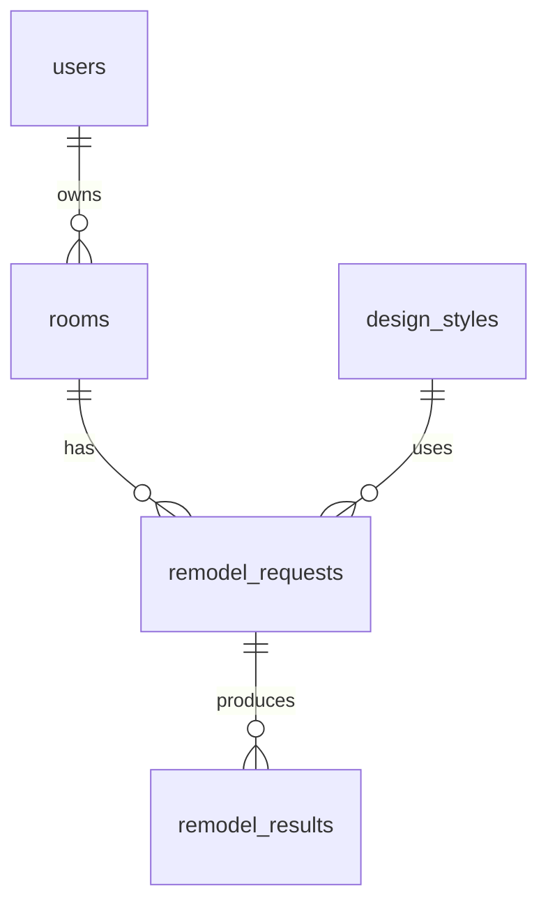

<div align="center">

# 🛋️ DecoraIA · Backend

**Toma una foto de tu cuarto y deja que la inteligencia artificial te proponga cómo remodelarlo.**

API REST del proyecto final de **Patrones de Diseño**


</div>

---

## 📌 ¿En qué consiste?

**DecoraIA** es una aplicación de diseño de interiores. El usuario sube una foto de un espacio (dormitorio, sala, cocina…), elige un estilo (moderno, nórdico, industrial, bohemio o minimalista) y opcionalmente un presupuesto y una paleta de colores. La IA analiza la foto y devuelve:

- una **imagen remodelada** del espacio con el estilo elegido, y
- una **lista de sugerencias** concretas (muebles, colores, iluminación).

Este repositorio es el **backend**: expone la API REST, guarda los datos en PostgreSQL y se comunica con el componente de IA, que es **intercambiable** (hoy un proveedor simulado, mañana un modelo real) sin tocar el resto del código.

| Componente | Repositorio | URL en producción |
|---|---|---|
| Frontend | [decora-ia-frontend](https://github.com/Santiago425/decora-ia-frontend) | https://decora-ia-frontend.vercel.app |
| Backend | [decora-ia-backend](https://github.com/Santiago425/decora-ia-backend) | https://decora-ia-backend.onrender.com/api/v1/hello |
| Base de datos | PostgreSQL en Neon | (privada) |

## 🔁 Flujo completo



## 🧩 Patrones de diseño aplicados

| Patrón | Tipo | Dónde | Para qué |
|---|---|---|---|
| **Singleton** | Creacional | [`src/db/Database.js`](src/db/Database.js) | Una única conexión (pool) a PostgreSQL compartida por toda la API. |
| **Builder** | Creacional | [`src/ai/builders/RemodelRequestBuilder.js`](src/ai/builders/RemodelRequestBuilder.js) | Construir paso a paso una solicitud de remodelación con muchos campos opcionales (estilo, presupuesto, colores, conservar muebles) y validarla al final. |
| **Abstract Factory** | Creacional | [`src/ai/factories/`](src/ai/factories) | Cada proveedor de IA (`MockAIFactory`, `ExternalAIFactory`) crea su propia **familia** de objetos compatibles: un analizador del cuarto y un generador de imágenes. Cambiar de modelo = cambiar de fábrica (`AI_PROVIDER`). |
| **Adapter** | Estructural | [`src/ai/adapters/AIServiceAdapter.js`](src/ai/adapters/AIServiceAdapter.js) | Traduce la API HTTP del servicio de IA externo (su formato, en `snake_case`) a las interfaces internas `RoomAnalyzer` e `ImageGenerator`. |
| **Decorator** | Estructural | [`src/ai/decorators/ImageGeneratorDecorators.js`](src/ai/decorators/ImageGeneratorDecorators.js) | Envuelve cualquier generador de imágenes para añadirle **reintentos** (`RetryDecorator`) y **registro de tiempos** (`LoggingDecorator`) sin modificarlo. |

Cómo trabajan juntos en una remodelación:



## 🗄️ Base de datos

Tablas (en inglés): `users`, `rooms`, `design_styles`, `remodel_requests`, `remodel_results`. El esquema completo está en [`src/db/schema.sql`](src/db/schema.sql).



## 🌐 Endpoints

| Método | Ruta | Descripción |
|---|---|---|
| `GET` | `/api/v1/hello` | Hello World del backend |
| `GET` | `/api/v1/health` | Estado de la API y de la base de datos |
| `GET` | `/api/v1/styles` | Estilos de diseño disponibles |
| `POST` | `/api/v1/remodels/preview` | Genera una propuesta de remodelación |

Ejemplo:

```bash
curl -X POST https://<backend>/api/v1/remodels/preview \
  -H "Content-Type: application/json" \
  -d '{"photoUrl":"https://example.com/cuarto.jpg","style":"nordic","budget":500}'
```

## 🚀 Ejecutar en local

```bash
npm install
cp .env.example .env      # poner tu DATABASE_URL
npm run migrate           # crea las tablas (el servidor también las crea al arrancar)
npm run dev               # http://localhost:3000/api/v1/hello
npm test
```

Con Docker:

```bash
docker build -t decora-ia-backend .
docker run -p 3000:3000 --env-file .env decora-ia-backend
```

## ☁️ Despliegue

| Pieza | Servicio | Notas |
|---|---|---|
| API | [Render](https://render.com) (Web Service, Docker, plan gratis) | Variables: `DATABASE_URL`, `CORS_ORIGIN`, `AI_PROVIDER` |
| Base de datos | [Neon](https://neon.tech) (PostgreSQL, plan gratis) | `npm run migrate` con la `DATABASE_URL` de Neon |
| CI | GitHub Actions | Tests + build de la imagen Docker en cada push |

## 📁 Estructura

```
src/
├── ai/
│   ├── adapters/      Adapter → servicio de IA externo
│   ├── builders/      Builder → solicitud de remodelación
│   ├── decorators/    Decorator → reintentos y logging
│   ├── factories/     Abstract Factory → proveedores de IA
│   ├── products/      Interfaces RoomAnalyzer / ImageGenerator
│   └── RemodelService.js
├── config/            Variables de entorno
├── db/                Singleton de conexión, esquema y migración
├── routes/            Endpoints REST
├── app.js
└── server.js
```

## 👥 Equipo

| Integrante | GitHub |
|---|---|
| Santiago Campoverde | [@Santiago425](https://github.com/Santiago425) |
| Never Melo | _@usuario_ |
