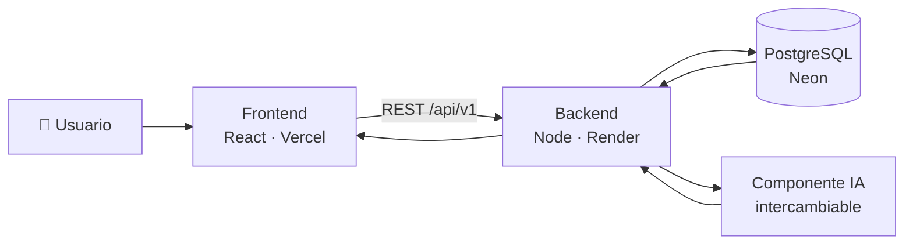
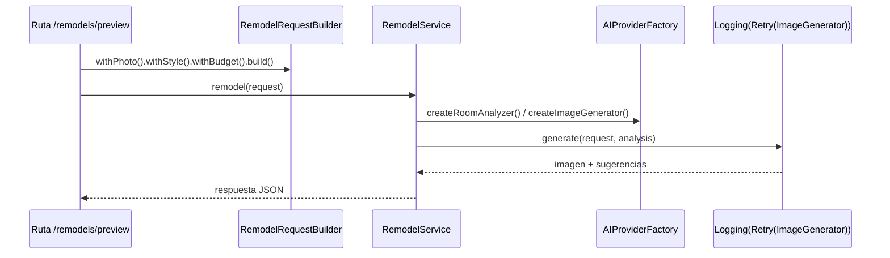
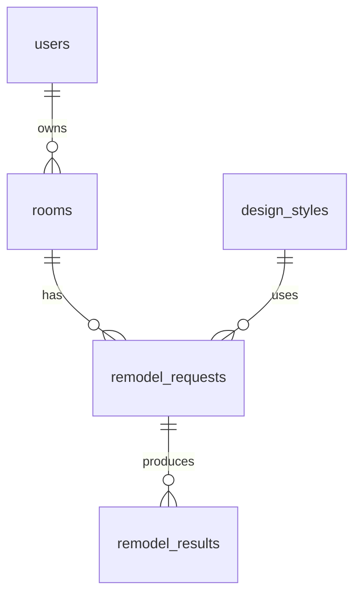

<div align="center">

# 🛋️ DecoraIA · Backend

**Toma una foto de tu cuarto y deja que la inteligencia artificial te proponga cómo remodelarlo.**

API REST del proyecto final de **Patrones de Diseño**


</div>

---

## 📌 ¿En qué consiste?

**DecoraIA** es una aplicación de diseño de interiores. El usuario sube una foto de un espacio (dormitorio, sala, cocina…), elige un estilo (moderno, nórdico, industrial, bohemio o minimalista) y opcionalmente un presupuesto y una paleta de colores. La IA analiza la foto y devuelve:

- una **imagen remodelada** del espacio con el estilo elegido, y
- una **lista de sugerencias** concretas (muebles, colores, iluminación).

Este repositorio es el **backend**: expone la API REST, guarda los datos en PostgreSQL y se comunica con el componente de IA, que es **intercambiable** (hoy un proveedor simulado, mañana un modelo real) sin tocar el resto del código.

| Componente | Repositorio | URL en producción |
|---|---|---|
| Frontend | [decora-ia-frontend](https://github.com/Santiago425/decora-ia-frontend) | https://decora-ia-frontend.vercel.app |
| Backend | [decora-ia-backend](https://github.com/Santiago425/decora-ia-backend) | https://decora-ia-backend.onrender.com/api/v1/hello |
| Documentación API | Swagger UI | https://decora-ia-backend.onrender.com/api/v1/docs |
| Base de datos | PostgreSQL en Neon | (privada) |

## 🔁 Flujo completo



## 🧩 Patrones de diseño aplicados

| Patrón | Tipo | Dónde | Para qué |
|---|---|---|---|
| **Singleton** | Creacional | [`src/db/Database.js`](src/db/Database.js) | Una única conexión (pool) a PostgreSQL compartida por toda la API. |
| **Builder** | Creacional | [`src/ai/builders/RemodelRequestBuilder.js`](src/ai/builders/RemodelRequestBuilder.js) | Construir paso a paso una solicitud de remodelación con muchos campos opcionales (estilo, presupuesto, colores, conservar muebles) y validarla al final. |
| **Abstract Factory** | Creacional | [`src/ai/factories/`](src/ai/factories) | Cada proveedor de IA (`MockAIFactory`, `ExternalAIFactory`) crea su propia **familia** de objetos compatibles: un analizador del cuarto y un generador de imágenes. Cambiar de modelo = cambiar de fábrica (`AI_PROVIDER`). |
| **Adapter** | Estructural | [`src/ai/adapters/AIServiceAdapter.js`](src/ai/adapters/AIServiceAdapter.js) | Traduce la API HTTP del servicio de IA externo (su formato, en `snake_case`) a las interfaces internas `RoomAnalyzer` e `ImageGenerator`. |
| **Decorator** | Estructural | [`src/ai/decorators/ImageGeneratorDecorators.js`](src/ai/decorators/ImageGeneratorDecorators.js) | Envuelve cualquier generador de imágenes para añadirle **reintentos** (`RetryDecorator`) y **registro de tiempos** (`LoggingDecorator`) sin modificarlo. |

Cómo trabajan juntos en una remodelación:



## 🗄️ Base de datos

Tablas (en inglés): `users`, `rooms`, `design_styles`, `remodel_requests`, `remodel_results`. El esquema completo está en [`src/db/schema.sql`](src/db/schema.sql).



## 🌐 Endpoints

📖 **Documentación interactiva (Swagger UI):** https://decora-ia-backend.onrender.com/api/v1/docs
Ahí se ve cada ruta con sus parámetros, ejemplos de petición y respuesta, y se puede probar directamente con el botón **Try it out**. La especificación OpenAPI en JSON está en [`/api/v1/openapi.json`](https://decora-ia-backend.onrender.com/api/v1/openapi.json) y su fuente en [`src/docs/openapi.js`](src/docs/openapi.js).

| Método | Ruta | Descripción |
|---|---|---|
| `GET` | `/api/v1/hello` | Hello World del backend |
| `GET` | `/api/v1/health` | Estado de la API y de la base de datos |
| `GET` | `/api/v1/styles` | Estilos de diseño disponibles |
| `GET` | `/api/v1/room-types` | Tipos de espacio disponibles |
| `POST` | `/api/v1/auth/register` | Crea una cuenta (`fullName`, `email`, `password`) y devuelve la sesión |
| `POST` | `/api/v1/auth/login` | Inicia sesión y devuelve un token JWT |
| `GET` | `/api/v1/auth/me` | Datos del usuario de la sesión 🔐 |
| `POST` | `/api/v1/remodels/preview` | Genera una propuesta de remodelación 🔐 |

🔐 = requiere la cabecera `Authorization: Bearer <token>`.

Ejemplo:

```bash
curl -X POST https://<backend>/api/v1/remodels/preview \
  -H "Content-Type: application/json" \
  -H "Authorization: Bearer <token>" \
  -d '{"photoUrl":"https://example.com/cuarto.jpg","style":"nordic","budget":500}'
```

## 🔒 Seguridad

| Medida | Dónde | Qué evita |
|---|---|---|
| Contraseñas con hash **scrypt** y sal aleatoria (nunca se guardan ni se devuelven en texto plano) | [`src/auth/PasswordHasher.js`](src/auth/PasswordHasher.js) | Robo de contraseñas si se filtra la base de datos. |
| Sesiones con **JWT** firmado (HS256, expira en 2 h) y rutas protegidas | [`src/auth/TokenService.js`](src/auth/TokenService.js), [`src/middleware/auth.js`](src/middleware/auth.js) | Uso de la IA sin cuenta y tokens falsificados. |
| Login con mensaje genérico y tiempo constante; máximo 10 intentos fallidos cada 15 min | [`src/auth/AuthService.js`](src/auth/AuthService.js) | Adivinar contraseñas o descubrir qué correos están registrados. |
| Cabeceras HTTP seguras (Helmet: CSP, `nosniff`, HSTS, sin `X-Powered-By`) | [`src/middleware/security.js`](src/middleware/security.js) | Clickjacking, *sniffing* de contenido y revelar la tecnología del servidor. |
| CORS restringido a los orígenes de `CORS_ORIGIN` | [`src/middleware/security.js`](src/middleware/security.js) | Que otras páginas web usen la API desde el navegador. |
| Límite de peticiones (`RATE_LIMIT_PER_MINUTE` por IP en los `POST`) | [`src/middleware/security.js`](src/middleware/security.js) | Abuso y saturación del servicio de IA. |
| Cuerpo JSON de máximo 20 KB y errores de JSON como `400` | [`src/app.js`](src/app.js) | Peticiones gigantes y errores internos expuestos. |
| Validación estricta en el Builder (URL `http(s)`, tipo de espacio, estilo, presupuesto, colores `#hex`) | [`src/ai/builders/RemodelRequestBuilder.js`](src/ai/builders/RemodelRequestBuilder.js) | Datos maliciosos o inválidos llegando a la IA (p. ej. `javascript:` o `file://`). |
| TLS verificado hacia PostgreSQL | [`src/db/Database.js`](src/db/Database.js) | Conexiones interceptadas a la base de datos. |
| Tiempo máximo de espera al servicio de IA (`AI_TIMEOUT_MS`) | [`src/ai/adapters/AIServiceAdapter.js`](src/ai/adapters/AIServiceAdapter.js) | Peticiones colgadas indefinidamente. |
| Mensajes de error genéricos (sin detalles internos) | [`src/routes/health.routes.js`](src/routes/health.routes.js) | Filtrar información de la base de datos. |
| Contenedor Docker sin privilegios de root | [`Dockerfile`](Dockerfile) | Que un fallo comprometa todo el contenedor. |
| Secretos solo en variables de entorno (`.env` ignorado por git) | [`.env.example`](.env.example) | Contraseñas subidas al repositorio. |

## 🚀 Ejecutar en local

```bash
npm install
cp .env.example .env      # poner tu DATABASE_URL
npm run migrate           # crea las tablas (el servidor también las crea al arrancar)
npm run dev               # http://localhost:3000/api/v1/hello
npm test
```

Con Docker:

```bash
docker build -t decora-ia-backend .
docker run -p 3000:3000 --env-file .env decora-ia-backend
```

## ☁️ Despliegue

| Pieza | Servicio | Notas |
|---|---|---|
| API | [Render](https://render.com) (Web Service, Docker, plan gratis) | Variables: `DATABASE_URL`, `CORS_ORIGIN` (URL del frontend), `JWT_SECRET`, `AI_PROVIDER`, `RATE_LIMIT_PER_MINUTE` |
| Base de datos | [Neon](https://neon.tech) (PostgreSQL, plan gratis) | `npm run migrate` con la `DATABASE_URL` de Neon |
| CI | GitHub Actions | Tests + build de la imagen Docker en cada push |

## 📁 Estructura

```
src/
├── auth/              Registro, login, hash de contraseñas y tokens
├── ai/
│   ├── adapters/      Adapter → servicio de IA externo
│   ├── builders/      Builder → solicitud de remodelación
│   ├── decorators/    Decorator → reintentos y logging
│   ├── factories/     Abstract Factory → proveedores de IA
│   ├── products/      Interfaces RoomAnalyzer / ImageGenerator
│   └── RemodelService.js
├── config/            Variables de entorno
├── db/                Singleton de conexión, esquema y migración
├── docs/              Especificación OpenAPI (Swagger)
├── middleware/        Seguridad: cabeceras, CORS, límite de peticiones, errores
├── routes/            Endpoints REST
├── users/             Acceso a la tabla users (PostgreSQL o memoria)
├── app.js
└── server.js
```

## 👥 Equipo

| Integrante | GitHub |
|---|---|
| Santiago Campoverde | [@Santiago425](https://github.com/Santiago425) |
| Never Melo | _@usuario_ |
